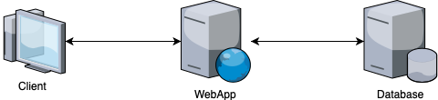

# CS2 MHC Task 2

## Requirements Specification

### Preface

Dieses Dokument richtet sich an alle involvierten Teammitglieder des Projektes "Spitex Organizer". Es inkludiert neben dem Team Black auch die Seite des Anwenders welche durch unsere Dozenten repräsentiert wird. Das Dokument soll jedoch auch für Laien verständlich und interpretierbar sein.

#### Versionsverlauf:
| Version | Changelog | Date |
|:--------|-----------|-----:|
|  0.1 | Initialdokument, Inhaltspunkte, Introduction | 01.04.2019 |
| 0.2 | Versionsverlauf-styling update | 01.04.2019 |
| 0.3 | Systemarchitektur hinzugefügt | 05.04.2019 |  
| 0.4 | System Models und System Evolution hinzugefügt | 06.04.2019 |  

### Introduction

Die Software "Spitex Organizer" des Teams Black soll die tägliche Arbeit von Spitexmitarbeitern bestmöglichst vereinfachen und somit zur Verbesserung der Arbeitsbedingungen wie auch zur Wirtschaftlichkeit beitragen.

Insbesondere liegt der Schwerpunkt der Software, soweit möglich, auf dem Krankheitsbild von Zwangsstörungen der "Obsessive Compulsive Disorder" oder kurz "OCD". Die Kernfunktionen umfassen insbesondere die Darstellung der Tages- und Wochenplanungen der Spitexmitarbeiter so wie deren, beim Patienten, zu erledigenden Tasks. Zusätzlich legt die Applikation besonderen Fokus auf das Rapportieren und das periodische Evaluieren der Patienten.

Der "Spitex Organizer" ist überwiegend eine anwenderspezifische Software mit möglichst einfacher und intuitiver Bedienung für die benutzende Person und soll sowohl in einem Browser wie auch auf einem Tablett genutzt werden können.

Die App soll die Spitexmitarbeiter bei der täglichen Arbeit unterstützen und jederzeit Einblicke in die zu erledigenden Arbeiten wie auch Patientendaten ermöglichen. Ebenso soll sie die Mitarbeiter bei der täglichen Rapportierung unterstützen. Auf diesem Weg soll die Planung vereinfacht, die Effizienz und somit die Wirtschaftlichkeit gesteigert und im gleichen Zug die Arbeitsbedingungen verbessert werden.

In einem weiterfährenden Projekt kann die Software mit einer Schnittstelle ausgestattet werden. Somit könnte der "Spitex Organizer" auch in bereits bestehende Systeme integriert werden.

### Glossary

| Abkürzungen | Bedeutung |
|:------------|:----------|

### User requirements definition (functional/non-functional)

### System architecture

#### Client

Der Benutzer muss irgendwie auf die Applikation zugreifen. Dies macht er durch einen Client, welcher in dem meisten Fällen ein Browser sein wird.

#### WebApp

Die Applikation, welche die Business Logik ausführt und mit der Datenbank kommuniziert.  
Sie antwortet auf Requests vom Client.

#### Database

Die Datenbank speichert alle benötigten Information über:
- Patienten
- Termine
- Verlaufsberichte
- Evaluationen
- etc.

### System requirements specification

Functional Requirements

- Das System überprüft periodisch ob für einen Patienten eine Evalutation fällig ist. 
- Das System ist in der Lage Daten in eine Datenbank zu speichern. 
- Das System ist in der Lage Patientendaten anzuzeigen.
- Das System ist in der Lage Verlaufsberichte zu anzeigen. 
- Das System ist in der Lage Verlaufsberichte zu erstellen. 
- Das System ist in der Lage Google Maps zu öffnen und die Route zum Patienten anzuzeigen. 
- Das System ist in der Lage die Wochenplanung vom Spitexmitarbeiter anzuzeigen.
- Das System ist in der Lage die Eingabefelder zu validieren.

Non-Functional Requirements 

- Das System hat eine benutzerfreundliche Oberfläche.
- Das System ist in der Lage dem Benutzer Fehlermeldungen zu liefern, wenn die Eingaben fehlerhaft sind.
- Das System ist intuitiv. 
- Das System ist responsive.

### System models

TODO
(Klassen)
- Patient
  - Name, Vorname, Wohnadresse, Alter, Telefon, Krankheit, Medikamente
  
- Spitexmitarbeiter
  - Name, Vorname, Benutzername, Passwort, Telefon
  
- Evaluation
  - Zeitstempel
  
- Verlauf
  - Patient, Verlauf, Zeitstempel, Spitexmitarbeiterin

### System evolution

TODO
- wie kann sich das System entwickeln (ev. Sicherheitsmechanismus mit Login, elektronische Patientendossiers, Zusammenspiel mit Krankenkasse, )
- Man kann im System einen Arbeitsplan (Kalenderform) für jeden Spitexmitarbeiter erstellen
- Automatisierte erstellung von Routen zu, welchen Patienten man am besten gehen sollte, um Zeit zu sparen
- Durch den Zeitstempel im Rapport, wird direkt eine Rechnung für die Krankenkasse erstellt
- Evaluations vergleich von mehreren Monaten, um einen Fortschritt der Behandlung zu erkennen

### Testing

Testfälle Functional Requirements

Testfälle Non-Functional Requirements

### Appendices

### Index
